# Simple Device Matching Backend Service. 

## Introduction

This project is a simple device matching backend service built using Java, Spring Boot, and Aerospike.

Below is the complete code documentation for your project, including the necessary components, code, and instructions for setup.

### Project Overview

**Objective:** Build a backend service that matches devices based on User-Agent strings using Spring Boot and Aerospike.

### Prerequisites - Project Setup

1. **Java Version:** Java 11 or higher.
2. **Spring Boot Version:** Latest stable version (as of writing this, it’s 3.x).
3. **Database:** Aerospike (Community version).
4. **Build Tool:** Maven.

## Setting up Aerospike Database using Docker:

### Install docker

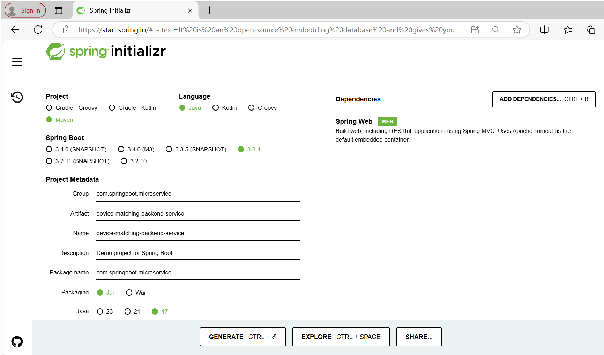
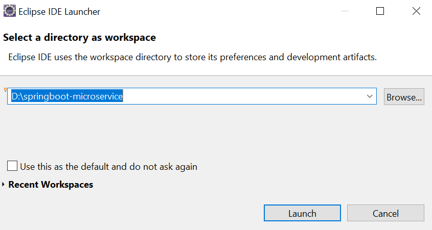
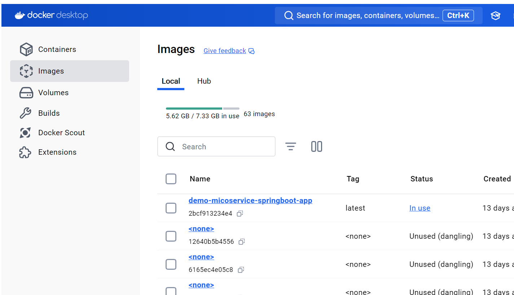
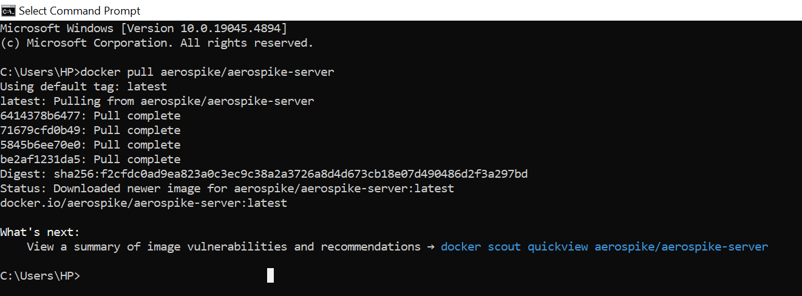
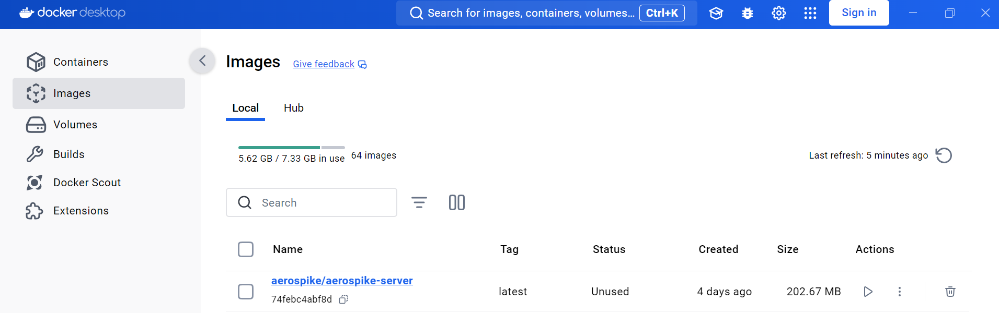
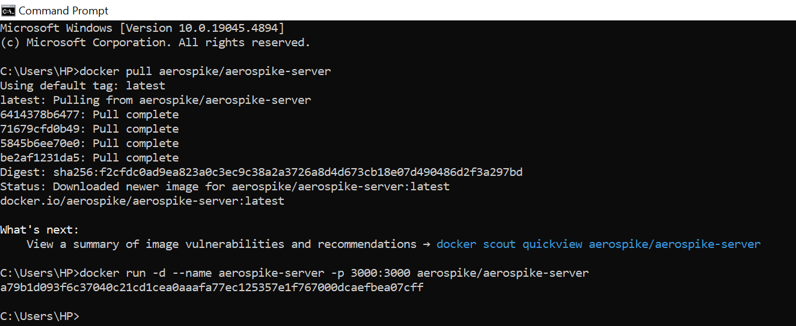
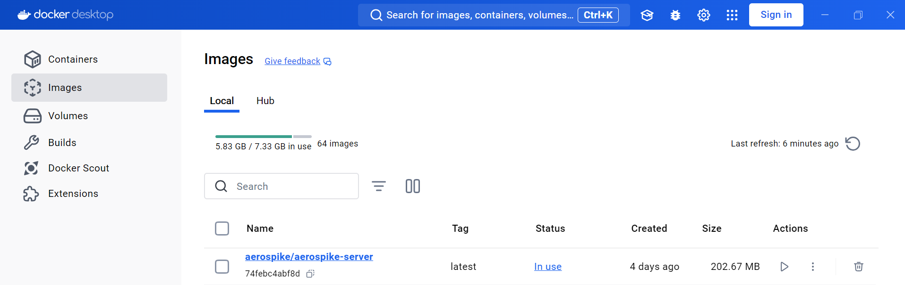
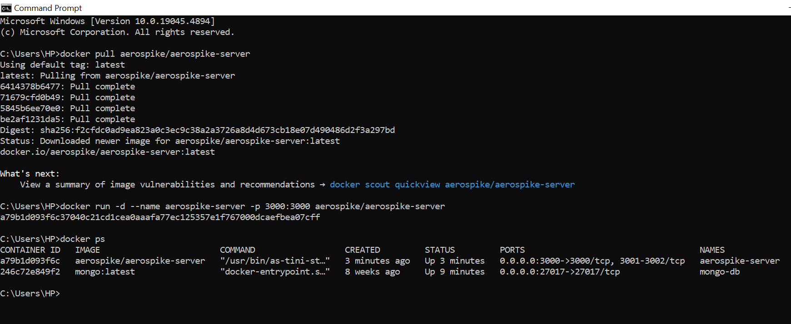
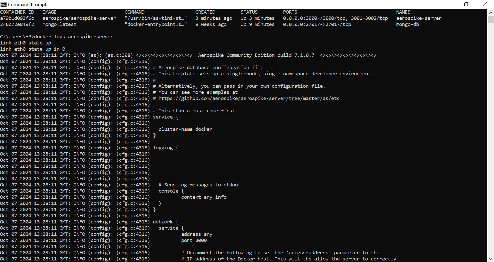
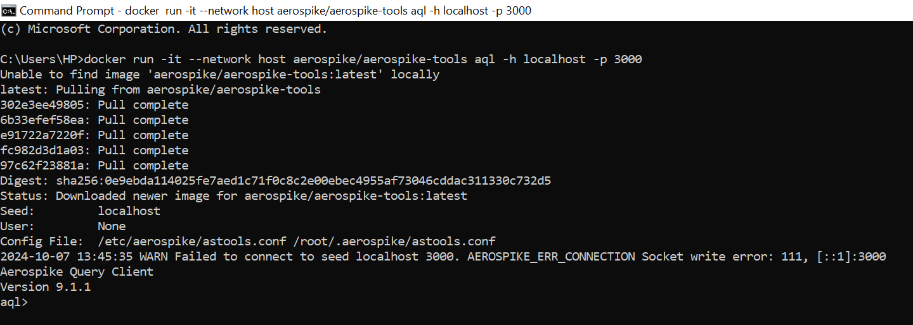
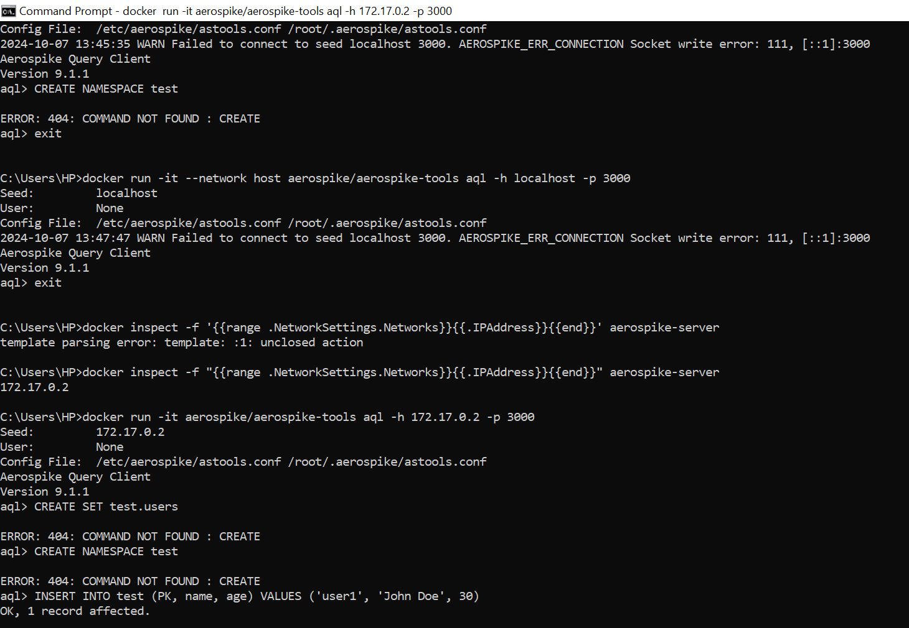
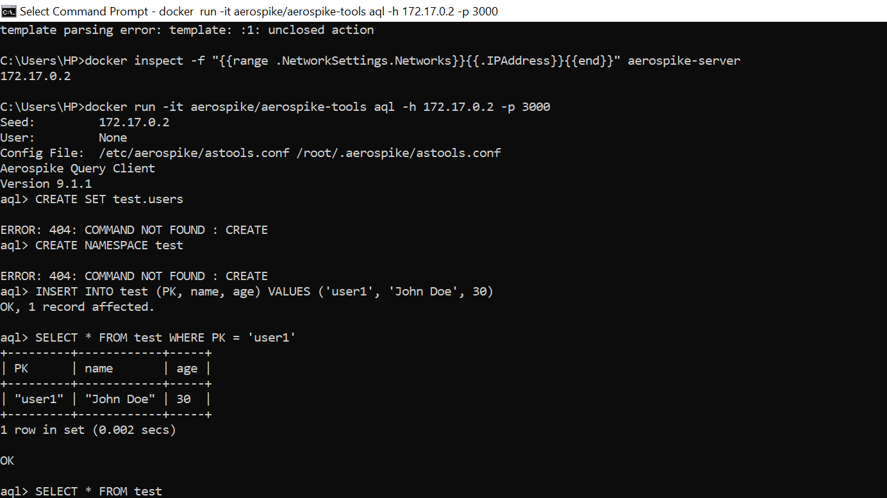
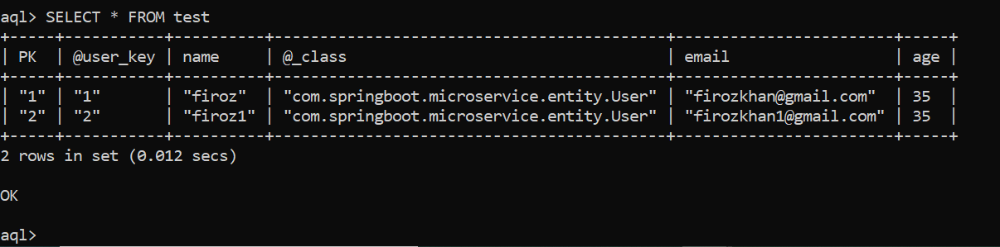
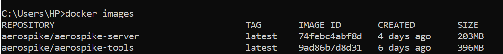
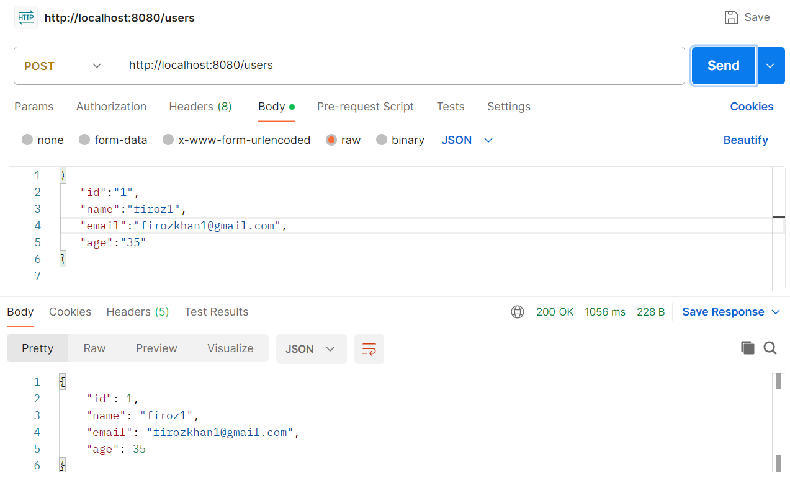

First you need to install docker on your local computer.

Download docker here:

https://docs.docker.com/engine/install/

Verify that docker is indeed installed by running:

$ docker --version
The output should look similar to this:

Docker version 27.0.3, build 7d4bcd8

2. Pull the Aerospike docker image

Once you installed docker, go to the following Aerospike docker image on docker hub:

https://hub.docker.com/r/aerospike/aerospike-server

You can follow the instructions in the above link for setting up Aerospike docker container, but for basic set up you can follow these instructions instead:

You can pull the docker image using the command:
```
Microsoft Windows [Version 10.0.19045.4894]
(c) Microsoft Corporation. All rights reserved.

C:\Users\HP>docker pull aerospike/aerospike-server
Using default tag: latest
latest: Pulling from aerospike/aerospike-server
6414378b6477: Pull complete
71679cfd0b49: Pull complete
5845b6ee70e0: Pull complete
be2af1231da5: Pull complete
Digest: sha256:f2cfdc0ad9ea823a0c3ec9c38a2a3726a8d4d673cb18e07d490486d2f3a297bd
Status: Downloaded newer image for aerospike/aerospike-server:latest
docker.io/aerospike/aerospike-server:latest

What's next:
    View a summary of image vulnerabilities and recommendations → docker scout quickview aerospike/aerospike-server
```

```
C:\Users\HP>docker run -d --name aerospike-server -p 3000:3000 aerospike/aerospike-server
a79b1d093f6c37040c21cd1cea0aaafa77ec125357e1f767000dcaefbea07cff
```

```
C:\Users\HP>docker ps
CONTAINER ID   IMAGE                        COMMAND                  CREATED         STATUS         PORTS                                   NAMES
a79b1d093f6c   aerospike/aerospike-server   "/usr/bin/as-tini-st…"   3 minutes ago   Up 3 minutes   0.0.0.0:3000->3000/tcp, 3001-3002/tcp   aerospike-server
246c72e849f2   mongo:latest                 "docker-entrypoint.s…"   8 weeks ago     Up 9 minutes   0.0.0.0:27017->27017/tcp                mongo-db
```

```
C:\Users\HP>docker logs aerospike-server
link eth0 state up
link eth0 state up in 0
Oct 07 2024 13:28:11 GMT: INFO (as): (as.c:308) <><><><><><><><><><>  Aerospike Community Edition build 7.1.0.7  <><><><><><><><><><>
Oct 07 2024 13:28:11 GMT: INFO (config): (cfg.c:4316)
Oct 07 2024 13:28:11 GMT: INFO (config): (cfg.c:4316) # Aerospike database configuration file
Oct 07 2024 13:28:11 GMT: INFO (config): (cfg.c:4316) # This template sets up a single-node, single namespace developer environment.
Oct 07 2024 13:28:11 GMT: INFO (config): (cfg.c:4316) #
Oct 07 2024 13:28:11 GMT: INFO (config): (cfg.c:4316) # Alternatively, you can pass in your own configuration file.
Oct 07 2024 13:28:11 GMT: INFO (config): (cfg.c:4316) # You can see more examples at
Oct 07 2024 13:28:11 GMT: INFO (config): (cfg.c:4316) # https://github.com/aerospike/aerospike-server/tree/master/as/etc
Oct 07 2024 13:28:11 GMT: INFO (config): (cfg.c:4316)
Oct 07 2024 13:28:11 GMT: INFO (config): (cfg.c:4316) # This stanza must come first.
Oct 07 2024 13:28:11 GMT: INFO (config): (cfg.c:4316) service {
Oct 07 2024 13:28:11 GMT: INFO (config): (cfg.c:4316)
Oct 07 2024 13:28:11 GMT: INFO (config): (cfg.c:4316)   cluster-name docker
Oct 07 2024 13:28:11 GMT: INFO (config): (cfg.c:4316) }
Oct 07 2024 13:28:11 GMT: INFO (config): (cfg.c:4316)
Oct 07 2024 13:28:11 GMT: INFO (config): (cfg.c:4316) logging {
Oct 07 2024 13:28:11 GMT: INFO (config): (cfg.c:4316)
Oct 07 2024 13:28:11 GMT: INFO (config): (cfg.c:4316)
Oct 07 2024 13:28:11 GMT: INFO (config): (cfg.c:4316)
Oct 07 2024 13:28:11 GMT: INFO (config): (cfg.c:4316)
Oct 07 2024 13:28:11 GMT: INFO (config): (cfg.c:4316)
Oct 07 2024 13:28:11 GMT: INFO (config): (cfg.c:4316)   # Send log messages to stdout
Oct 07 2024 13:28:11 GMT: INFO (config): (cfg.c:4316)   console {
Oct 07 2024 13:28:11 GMT: INFO (config): (cfg.c:4316)           context any info
Oct 07 2024 13:28:11 GMT: INFO (config): (cfg.c:4316)   }
Oct 07 2024 13:28:11 GMT: INFO (config): (cfg.c:4316) }
Oct 07 2024 13:28:11 GMT: INFO (config): (cfg.c:4316)
Oct 07 2024 13:28:11 GMT: INFO (config): (cfg.c:4316) network {
Oct 07 2024 13:28:11 GMT: INFO (config): (cfg.c:4316)   service {
Oct 07 2024 13:28:11 GMT: INFO (config): (cfg.c:4316)           address any
Oct 07 2024 13:28:11 GMT: INFO (config): (cfg.c:4316)           port 3000
Oct 07 2024 13:28:11 GMT: INFO (config): (cfg.c:4316)
Oct 07 2024 13:28:11 GMT: INFO (config): (cfg.c:4316)           # Uncomment the following to set the 'access-address' parameter to the
Oct 07 2024 13:28:11 GMT: INFO (config): (cfg.c:4316)           # IP address of the Docker host. This will the allow the server to correctly
Oct 07 2024 13:28:11 GMT: INFO (config): (cfg.c:4316)           # publish the address which applications and other nodes in the cluster to
Oct 07 2024 13:28:11 GMT: INFO (config): (cfg.c:4316)           # use when addressing this node.
Oct 07 2024 13:28:11 GMT: INFO (config): (cfg.c:4316)           # access-address <IPADDR>
Oct 07 2024 13:28:11 GMT: INFO (config): (cfg.c:4316)   }
```

```
C:\Users\HP>docker run -it --network host aerospike/aerospike-tools aql -h localhost -p 3000
Unable to find image 'aerospike/aerospike-tools:latest' locally
latest: Pulling from aerospike/aerospike-tools
302e3ee49805: Pull complete
6b33efef58ea: Pull complete
e91722a7220f: Pull complete
fc982d3d1a03: Pull complete
97c62f23881a: Pull complete
Digest: sha256:0e9ebda114025fe7aed1c71f0c8c2e00ebec4955af73046cddac311330c732d5
Status: Downloaded newer image for aerospike/aerospike-tools:latest
Seed:         localhost
User:         None
Config File:  /etc/aerospike/astools.conf /root/.aerospike/astools.conf
2024-10-07 13:45:35 WARN Failed to connect to seed localhost 3000. AEROSPIKE_ERR_CONNECTION Socket write error: 111, [::1]:3000
Aerospike Query Client
Version 9.1.1
aql> 
```

```
C:\Users\HP>docker inspect -f "{{range .NetworkSettings.Networks}}{{.IPAddress}}{{end}}" aerospike-server
172.17.0.2

C:\Users\HP>docker run -it aerospike/aerospike-tools aql -h 172.17.0.2 -p 3000
Seed:         172.17.0.2
User:         None
Config File:  /etc/aerospike/astools.conf /root/.aerospike/astools.conf
Aerospike Query Client
Version 9.1.1
aql>
```

```
aql> INSERT INTO test (PK, name, age) VALUES ('user1', 'John Doe', 30)
OK, 1 record affected.

aql> SELECT * FROM test WHERE PK = 'user1'
+---------+------------+-----+
| PK      | name       | age |
+---------+------------+-----+
| "user1" | "John Doe" | 30  |
+---------+------------+-----+
1 row in set (0.002 secs)

OK

aql> SELECT * FROM test
+--------------+-----------------------------------------------------------------+-----+------------------------+------------+-----------+
| PK           | @_class                                                         | age | email                  | name       | @user_key |
+--------------+-----------------------------------------------------------------+-----+------------------------+------------+-----------+
| "1"          | "com.aerospike.demo.simplespringbootaerospikedemo.objects.User" | 35  | "firozkhan@gmail.com"  | "firoz"    |           |
| "2"          | "com.springboot.microservice.entity.User"                       | 35  | "firozkhan1@gmail.com" | "firoz1"   | "2"       |
| "user1"      |                                                                 | 30  |                        | "John Doe" |           |
+--------------+-----------------------------------------------------------------+-----+------------------------+------------+-----------+
3 rows in set (0.012 secs)

OK

aql> DELETE FROM test WHERE PK = 'user1'
OK, 1 record affected.

aql> SELECT * FROM test
+-----+-----------+----------+-------------------------------------------+------------------------+-----+
| PK  | @user_key | name     | @_class                                   | email                  | age |
+-----+-----------+----------+-------------------------------------------+------------------------+-----+
| "1" | "1"       | "firoz"  | "com.springboot.microservice.entity.User" | "firozkhan@gmail.com"  | 35  |
| "2" | "2"       | "firoz1" | "com.springboot.microservice.entity.User" | "firozkhan1@gmail.com" | 35  |
+-----+-----------+----------+-------------------------------------------+------------------------+-----+
2 rows in set (0.012 secs)

OK

aql>
```

Verify that you have Aerospike docker image by running:

$ docker images
The output should contain a row similar to this:


You can also see it in the Docker GUI under “images” section:


3. Run the Aerospike Docker image

Run the docker image by running:

$ docker run --rm -tid --name aerospike-server -p 3000:3000 -p 3001:3001 -p 3002:3002 -p 3003:3003 aerospike/aerospike-server
Aerospike docker container should be up and running, verify this by running:

$ docker ps
The output should contain a row similar to this:


You can also see it in the Docker GUI under “Containers / Apps” section:

### Setup the project:

You can set up a Spring Boot project the way you’re familiar with, In this example we will use Spring Initializr (recommended).

Go to: https://start.spring.io/

a. At the left side of the screen you can configure your Spring Boot application:

### Project Structure

```
device-matching-backend-service/
│
├── src/
│   ├── main/
│   │   ├── java/
│   │   │   └── com/
│   │   │       └── springboot/
│   │   │           └── microservice/
│   │   │               ├── config/
│   │   │               │   └── DeviceMatchingConfiguration.java
│   │   │               │   └── DeviceMatchingConfigurationProperties.java
│   │   │               ├── controller/
│   │   │               │   └── UserController.java
│   │   │               │   └── DeviceController.java
│   │   │               ├── model/
│   │   │               │   └── User.java
│   │   │               │   └── Device.java
│   │   │               ├── repository/
│   │   │               │   └── UserRepository.java
│   │   │               │   └── DeviceRepository.java
│   │   │               ├── service/
│   │   │               │   └── UserService.java
│   │   │               │   └── DeviceService.java
│   │   │               └── DeviceMatchingApplication.java
│   │   └── resources/
│   │       ├── application.properties
│   │       └── static/
│   │       └── templates/
│   └── test/
│       └── java/
│           └── com/
│               └── springboot/
│                   └── microservice/
│                       ├── service/
│                       │    └── DeviceServiceTest.java
│                       │    └── UserRepositoryTests.java
│                       └── DeviceMatchingApplicationTests.java
│
├── pom.xml
└── README.md
```

### Dependencies (`pom.xml`)

Here’s a basic `pom.xml` with necessary dependencies:

```xml
<?xml version="1.0" encoding="UTF-8"?>
<project xmlns="http://maven.apache.org/POM/4.0.0"
	xmlns:xsi="http://www.w3.org/2001/XMLSchema-instance"
	xsi:schemaLocation="http://maven.apache.org/POM/4.0.0 https://maven.apache.org/xsd/maven-4.0.0.xsd">
	<modelVersion>4.0.0</modelVersion>
	<parent>
		<groupId>org.springframework.boot</groupId>
		<artifactId>spring-boot-starter-parent</artifactId>
		<version>3.3.0</version>
		<relativePath /> <!-- lookup parent from repository -->
	</parent>
	<groupId>com.springboot.microservice</groupId>
	<artifactId>device-matching-backend-service</artifactId>
	<version>0.0.1-SNAPSHOT</version>
	<name>device-matching-backend-service</name>
	<description>Demo project for Spring Boot</description>
	<properties>
		<java.version>17</java.version>
		<lombok>1.18.32</lombok>
		<spring-data-aerospike>4.8.0</spring-data-aerospike>
		<aerospike-client>7.2.1</aerospike-client>
	</properties>
	<dependencies>
		<dependency>
			<groupId>org.springframework.boot</groupId>
			<artifactId>spring-boot-starter-web</artifactId>
		</dependency>
		<dependency>
			<groupId>com.aerospike</groupId>
			<artifactId>spring-data-aerospike</artifactId>
			<version>${spring-data-aerospike}</version>
		</dependency>
		<dependency>
			<groupId>com.aerospike</groupId>
			<artifactId>aerospike-client</artifactId>
			<version>${aerospike-client}</version> <!-- match this with your
			starter version -->
		</dependency>
		<dependency>
			<groupId>org.projectlombok</groupId>
			<artifactId>lombok</artifactId>
			<version>${lombok}</version>
			<optional>true</optional>
		</dependency>
		<dependency>
			<groupId>org.springframework.boot</groupId>
			<artifactId>spring-boot-starter-test</artifactId>
			<scope>test</scope>
		</dependency>
		<dependency>
			<groupId>org.junit.jupiter</groupId>
			<artifactId>junit-jupiter</artifactId>
			<version>5.9.0</version> <!-- Or the latest version -->
			<scope>test</scope>
		</dependency>
	</dependencies>
	<build>
		<plugins>
			<plugin>
				<groupId>org.springframework.boot</groupId>
				<artifactId>spring-boot-maven-plugin</artifactId>
				<configuration>
					<excludes>
						<exclude>
							<groupId>org.projectlombok</groupId>
							<artifactId>lombok</artifactId>
						</exclude>
					</excludes>
				</configuration>
			</plugin>
			<plugin>
				<groupId>org.apache.maven.plugins</groupId>
				<artifactId>maven-surefire-plugin</artifactId>
				<configuration>
					<argLine>--add-opens java.base/java.util=ALL-UNNAMED
						--add-opens java.base/java.math=ALL-UNNAMED</argLine>
				</configuration>
			</plugin>
		</plugins>
	</build>
</project>
```

### Application Properties (`application.properties`)

Configure the connection to Aerospike:

```properties
spring.application.name=device-matching-backend-service

device.matching.host=127.0.0.1
device.matching.port=3000
device.matching.namespace=test
spring.data.aerospike.scans-enabled=true

```

### Main Application Class (`DeviceMatchingApplication.java`)

```java
package com.springboot.microservice;

import org.springframework.boot.SpringApplication;
import org.springframework.boot.autoconfigure.SpringBootApplication;
import org.springframework.boot.autoconfigure.jdbc.DataSourceAutoConfiguration;

@SpringBootApplication(exclude = {DataSourceAutoConfiguration.class })
public class DeviceMatchingApplication {

	public static void main(String[] args) {
		SpringApplication.run(DeviceMatchingApplication.class, args);
	}
}

```

### Model Class (`Device.java`)

```java
package com.springboot.microservice.entity;

import org.springframework.data.annotation.Id;

import java.util.Objects;

import org.springframework.data.aerospike.mapping.Document;

@Document
public class Device {
    @Id
    private String id;
    private String osName;
    private String osVersion;
    private String browserName;
    private String browserVersion;
    private int hitCount;

	public String getId() {
		return id;
	}

	public void setId(String id) {
		this.id = id;
	}

	public int getHitCount() {
		return hitCount;
	}

	public void setHitCount(int hitCount) {
		this.hitCount = hitCount;
	}

	public String getOsName() {
		return osName;
	}

	public void setOsName(String osName) {
		this.osName = osName;
	}

	public String getOsVersion() {
		return osVersion;
	}

	public void setOsVersion(String osVersion) {
		this.osVersion = osVersion;
	}

	public String getBrowserName() {
		return browserName;
	}

	public void setBrowserName(String browserName) {
		this.browserName = browserName;
	}

	public String getBrowserVersion() {
		return browserVersion;
	}

	public void setBrowserVersion(String browserVersion) {
		this.browserVersion = browserVersion;
	}

	public Device(String id, String osName, String osVersion, String browserName, String browserVersion, int hitCount) {
        this.id = id;
        this.osName = osName;
        this.osVersion = osVersion;
        this.browserName = browserName;
        this.browserVersion = browserVersion;
        this.hitCount = hitCount;
    }

    public Device() {
    }
    
    @Override
    public boolean equals(Object o) {
        if (this == o) return true;
        if (!(o instanceof Device)) return false;
        Device device = (Device) o;
        return  Objects.equals(id, device.id) &&
                Objects.equals(osName, device.osName) &&
                Objects.equals(osVersion, device.osVersion) &&
                Objects.equals(browserName, device.browserName) &&
                Objects.equals(browserVersion, device.browserVersion) &&
                hitCount == device.hitCount;
    }

    @Override
    public int hashCode() {
        return Objects.hash(id, osName, osVersion, browserName, browserVersion, hitCount);
    }
}
```

### Repository Interface (`DeviceRepository.java`)

```java
package com.springboot.microservice.repository;

import java.util.List;

import org.springframework.data.aerospike.repository.AerospikeRepository;

import com.springboot.microservice.entity.Device;
public interface DeviceRepository extends AerospikeRepository<Device, String> {
	
    Device findByOsNameAndOsVersionAndBrowserNameAndBrowserVersion(String osName, String osVersion, String browserName, String browserVersion);

    List<Device> findByOsName(String osName);    
}
```

### Service Class (`DeviceService.java`)

```java
package com.springboot.microservice.service;

import java.util.ArrayList;
import java.util.List;

import org.slf4j.Logger;
import org.slf4j.LoggerFactory;
import org.springframework.stereotype.Service;

import com.aerospike.client.AerospikeClient;
import com.aerospike.client.Bin;
import com.aerospike.client.Key;
import com.aerospike.client.Record;
import com.aerospike.client.policy.ClientPolicy;
import com.aerospike.client.policy.WritePolicy;
import com.aerospike.client.query.Filter;
import com.aerospike.client.query.RecordSet;
import com.aerospike.client.query.Statement;
import com.springboot.microservice.entity.Device;
import com.springboot.microservice.exception.DeviceServiceException;

@Service
public class DeviceService {

	private static final Logger logger = LoggerFactory.getLogger(DeviceService.class);

	// Define the namespace and set
	private final String namespace = "test";
	private final String setName = "devices";

	public Device matchOrCreateDevice(String userAgent) {

		// Parse User-Agent to extract OS and Browser details
		String osName = extractOSName(userAgent);
		String osVersion = extractOSVersion(userAgent);
		String browserName = extractBrowserName(userAgent);
		String browserVersion = extractBrowserVersion(userAgent);

		// Create a key for the record
		// String deviceId = UUID.randomUUID().toString();
		// Key key = new Key(namespace, setName, deviceId);
		Key key = new Key(namespace, setName, "1"); // Unique primary key for the record

		// Define the bins you want to retrieve
		String[] binNames = new String[] { "os_name", "os_version", "berowser_name", "browser_version", "hit_count" };

		try {
			Record record = getAerospikeClient().get(null, key, binNames);
			if (record != null) {
				int hitCount = record.getInt("hit_count") + 1;
				getAerospikeClient().put(new WritePolicy(), key, new Bin("hit_count", hitCount));
				logger.info("Updated device: {}", key.userKey);
				return new Device(key.userKey.toString(), record.getString("os_name"), record.getString("os_version"),
						record.getString("berowser_name"), record.getString("browser_version"), hitCount);
			} else {
				getAerospikeClient().put(new WritePolicy(), key, new Bin("os_name", osName),
						new Bin("os_version", osVersion), new Bin("berowser_name", browserName),
						new Bin("browser_version", browserVersion), new Bin("hit_count", 1));
				logger.info("Created new device: {}", key.userKey);
				return new Device(key.userKey.toString(), osName, osVersion, browserName, browserVersion, 1);
			}
		} catch (Exception e) {
			logger.error("Error while matching or creating device", e);
			throw new DeviceServiceException("Error while matching or creating device", e);
		} finally {
			getAerospikeClient().close();
		}
	}

	public Device getDeviceById(String deviceId) {

		Device device;
		// Create a key for the record
		// String deviceId = UUID.randomUUID().toString();
		// Key key = new Key(namespace, setName, deviceId);
		Key key = new Key(namespace, setName, "1"); // Unique primary key for the record

		// Retrieve the record
		String[] binNames = new String[] { "os_name", "os_version", "berowser_name", "browser_version", "hit_count" };

		try {
			Record record = getAerospikeClient().get(null, key, binNames);
			if (record != null) {
				logger.info("Record found for device ID: {}", deviceId);
				return new Device(key.userKey.toString(), record.getString("os_name"), record.getString("os_version"),
						record.getString("berowser_name"), record.getString("browser_version"),
						record.getInt("hit_count"));
			} else {
				logger.warn("Device ID {} not found, returning default device", deviceId);
				return new Device(deviceId, "Unknown OS", "Unknown Version", "Unknown Browser", "Unknown Version", 0);
			}
		} catch (Exception e) {
			logger.error("Error while retrieving device by ID: {}", deviceId, e);
			throw new DeviceServiceException("Error while retrieving device by ID", e);
		} finally {
			getAerospikeClient().close();
		}
	}

	public List<Device> getDevicesByOS(String osName) {

		List<Device> listOfDevices = new ArrayList<Device>();
		// Create a query statement
		Statement statement = new Statement();
		statement.setNamespace(namespace);
		statement.setSetName(setName);
		// Add filters for the query
		statement.setFilter(Filter.equal("os_name", osName));

		// Execute the query
		try (RecordSet recordSet = getAerospikeClient().query(null, statement)) {
			while (recordSet.next()) {
				Record record = recordSet.getRecord();
				logger.info(
						"Record found: OS Name: {}, OS Version: {}, Browser Name: {}, Browser Version: {}, Hit Count: {}",
						record.getString("os_name"), record.getString("os_version"), record.getString("berowser_name"),
						record.getString("browser_version"), record.getInt("hit_count"));

				listOfDevices.add(new Device(record.getString("id"), record.getString("os_name"),
						record.getString("os_version"), record.getString("berowser_name"),
						record.getString("browser_version"), record.getInt("hit_count")));
			}
		} catch (Exception e) {
			e.printStackTrace();
			logger.error("Error while retrieving devices by OS: {}", osName, e);
		} finally {
			getAerospikeClient().close();
		}
		return listOfDevices;
	}

	public void deleteDevice(String deviceId) {
		
		// Create a key for the record
		// String deviceId = UUID.randomUUID().toString();
		Key key = new Key(namespace, setName, deviceId);

		try {
			boolean isDeleted = getAerospikeClient().delete(new WritePolicy(), key);
			if (!isDeleted) {
				logger.warn("Record with key {} not found for deletion.", key.userKey);
			} else {
				logger.info("Record with key {} has been deleted successfully.", key.userKey);
			}
		} catch (Exception e) {
			logger.error("Error while deleting device with ID: {}", deviceId, e);
			throw new DeviceServiceException("Error while deleting device", e);
		} finally {
			getAerospikeClient().close();
		}
	}

	/**
	 * Implement logic to extract OS name from the User-Agent string Example:
	 * "Windows NT 10.0" -> "Windows
	 * 
	 * @param userAgent
	 * @return
	 */
	private String extractOSName(String userAgent) {
		if (userAgent.contains("Windows"))
			return "Windows";
		if (userAgent.contains("Mac OS"))
			return "MacOS";
		if (userAgent.contains("Linux"))
			return "Linux";
		if (userAgent.contains("Android"))
			return "Android";
		if (userAgent.contains("iPhone") || userAgent.contains("iPad"))
			return "iOS";
		return "Unknown OS";
	}

	/**
	 * Implement logic to extract OS version from the User-Agent string Example:
	 * "Windows NT 10.0" -> "10.0" Return a version or "Unknown Version" if not
	 * found
	 * 
	 * @param userAgent
	 * @return String
	 */
	private String extractOSVersion(String userAgent) {
		return userAgent.replaceAll(".*?(\\d+\\.\\d+).*", "$1");
	}

	/**
	 * Implement logic to extract Browser name from the User-Agent string
	 */
	private String extractBrowserName(String userAgent) {
		if (userAgent.contains("Chrome"))
			return "Chrome";
		if (userAgent.contains("Firefox"))
			return "Firefox";
		if (userAgent.contains("Safari"))
			return "Safari";
		if (userAgent.contains("Edge"))
			return "Edge";
		return "Unknown Browser";
	}

	/**
	 * Implement logic to extract Browser version from the User-Agent string
	 * Simplified example for Chrome
	 */
	private String extractBrowserVersion(String userAgent) {
		if (userAgent.contains("Chrome")) {
			return userAgent.split("Chrome/")[1].split(" ")[0];
		}
		return "Unknown Version";
	}

	private AerospikeClient getAerospikeClient() {
		// Configure the Aerospike client
		ClientPolicy clientPolicy = new ClientPolicy();
		AerospikeClient aerospikeClient = new AerospikeClient(clientPolicy, "localhost", 3000); // Adjust host/port as
																								// necessary
		return aerospikeClient;
	}
}
```

### Controller Class (`DeviceController.java`)

```java
package com.springboot.microservice.rest;

import java.util.List;

import org.springframework.beans.factory.annotation.Autowired;
import org.springframework.web.bind.annotation.DeleteMapping;
import org.springframework.web.bind.annotation.GetMapping;
import org.springframework.web.bind.annotation.PathVariable;
import org.springframework.web.bind.annotation.PostMapping;
import org.springframework.web.bind.annotation.RequestHeader;
import org.springframework.web.bind.annotation.RequestMapping;
import org.springframework.web.bind.annotation.RestController;

import com.springboot.microservice.entity.Device;
import com.springboot.microservice.service.DeviceService;

@RestController
@RequestMapping("/devices")
public class DeviceController {
	@Autowired
	private DeviceService deviceService;

	@PostMapping("/match")
	public Device matchDevice(@RequestHeader("User-Agent") String userAgent) {
		return deviceService.matchOrCreateDevice(userAgent);
	}

	@GetMapping("/{id}")
	public Device getDeviceById(@PathVariable String id) {
		return deviceService.getDeviceById(id);
	}

	@GetMapping("/os/{osName}")
	public List<Device> getDevicesByOS(@PathVariable String osName) {
		return deviceService.getDevicesByOS(osName);
	}

	@DeleteMapping("/{id}")
	public void deleteDevice(@PathVariable String id) {
		deviceService.deleteDevice(id);
	}
}
```

### Unit Tests (`DeviceMatchingApplicationTests.java`)

```java
package com.springboot.microservice;

import org.junit.jupiter.api.Test;
import org.springframework.boot.test.context.SpringBootTest;

@SpringBootTest
class DeviceMatchingApplicationTests {

	@Test
	void contextLoads() {
	}
}
```

### Unit Tests (`DeviceServiceTest.java`)

```java
package com.springboot.microservice.service;

import static org.junit.jupiter.api.Assertions.assertEquals;
import static org.junit.jupiter.api.Assertions.assertNotNull;
import static org.mockito.ArgumentMatchers.any;
import static org.mockito.ArgumentMatchers.eq;
import static org.mockito.Mockito.doNothing;
import static org.mockito.Mockito.mock;
import static org.mockito.Mockito.verify;
import static org.mockito.Mockito.when;

import java.util.List;
import java.util.UUID;

import org.junit.jupiter.api.BeforeEach;
import org.junit.jupiter.api.Test;
import org.mockito.InjectMocks;
import org.mockito.Mock;
import org.mockito.MockitoAnnotations;

import com.aerospike.client.AerospikeClient;
import com.aerospike.client.Bin;
import com.aerospike.client.Key;
import com.aerospike.client.Record;
import com.aerospike.client.policy.WritePolicy;
import com.aerospike.client.query.RecordSet;
import com.aerospike.client.query.Statement;
import com.springboot.microservice.entity.Device;

public class DeviceServiceTest {

	@InjectMocks
	private DeviceService deviceService;

	@Mock
	private AerospikeClient aerospikeClient;

	@Mock
	private RecordSet recordSet;

	@Mock
	private Record record;

	private final String namespace = "test";
	private final String setName = "devices";

	@BeforeEach
	public void setup() {
		MockitoAnnotations.openMocks(this);
	}

	@Test
	public void testMatchOrCreateDevice_NewDevice() {
		String userAgent = "Mozilla/5.0 (Windows NT 10.0; Win64; x64) AppleWebKit/537.36 (KHTML, like Gecko) Chrome/91.0.4472.124 Safari/537.36";
		UUID deviceId = UUID.randomUUID();
		Key key = new Key(namespace, setName, deviceId.toString());

		// Mock behavior for a new device
		when(aerospikeClient.get(null, key,
				new String[] { "os_name", "os_version", "browser_name", "browser_version", "hit_count" }))
				.thenReturn(null);
		doNothing().when(aerospikeClient).put(any(WritePolicy.class), eq(key), any(Bin[].class));

		// Call the method
		Device device = deviceService.matchOrCreateDevice(userAgent);

		// Validate results
		assertNotNull(device);
		assertEquals("Windows 10", device.getOsName());
		assertEquals("10.0", device.getOsVersion());
		assertEquals("Chrome", device.getBrowserName());
		assertEquals("91.0.4472.124", device.getBrowserVersion());
		assertEquals(1, device.getHitCount());

		// Verify interactions
		verify(aerospikeClient).put(any(WritePolicy.class), eq(key), any(Bin[].class));
	}

	@Test
	public void testMatchOrCreateDevice_ExistingDevice() {
		String userAgent = "Mozilla/5.0 (Windows NT 10.0; Win64; x64) AppleWebKit/537.36 (KHTML, like Gecko) Chrome/91.0.4472.124 Safari/537.36";
		UUID deviceId = UUID.randomUUID();
		Key key = new Key(namespace, setName, deviceId.toString());

		// Mock existing record
		when(aerospikeClient.get(null, key,
				new String[] { "os_name", "os_version", "browser_name", "browser_version", "hit_count" }))
				.thenReturn(record);
		when(record.getInt("hit_count")).thenReturn(1);
		when(record.getString("os_name")).thenReturn("Windows 10");
		when(record.getString("os_version")).thenReturn("10.0");
		when(record.getString("browser_name")).thenReturn("Chrome");
		when(record.getString("browser_version")).thenReturn("91.0.4472.124");

		// Call the method
		Device device = deviceService.matchOrCreateDevice(userAgent);

		// Validate results
		assertNotNull(device);
		assertEquals(2, device.getHitCount()); // Expect hit count to be incremented

		// Verify interactions
		verify(aerospikeClient).put(any(WritePolicy.class), eq(key), new Bin("hit_count", 2));
	}

	@Test
	public void testGetDeviceById_DeviceNotFound() {
		String deviceId = UUID.randomUUID().toString();
		Key key = new Key(namespace, setName, deviceId);

		// Mock no record found
		when(aerospikeClient.get(null, key,
				new String[] { "os_name", "os_version", "browser_name", "browser_version", "hit_count" }))
				.thenReturn(null);

		// Call the method
		Device device = deviceService.getDeviceById(deviceId);

		// Validate results
		assertNotNull(device);
		assertEquals(deviceId, device.getId());
		assertEquals("Unknown OS", device.getOsName());
	}

	@Test
	public void testGetDeviceById_DeviceFound() {
		String deviceId = UUID.randomUUID().toString();
		Key key = new Key(namespace, setName, deviceId);

		// Mock record setup
		when(aerospikeClient.get(null, key,
				new String[] { "os_name", "os_version", "browser_name", "browser_version", "hit_count" }))
				.thenReturn(record);
		when(record.getString("os_name")).thenReturn("Windows 10");
		when(record.getString("os_version")).thenReturn("10.0");
		when(record.getString("browser_name")).thenReturn("Chrome");
		when(record.getString("browser_version")).thenReturn("91.0.4472.124");
		when(record.getInt("hit_count")).thenReturn(1);

		// Call the method
		Device device = deviceService.getDeviceById(deviceId);

		// Validate results
		assertNotNull(device);
		assertEquals(deviceId, device.getId());
		assertEquals("Windows 10", device.getOsName());
	}

	@Test
	public void testGetDevicesByOS() {
		String osName = "Windows 10";
		String deviceId = UUID.randomUUID().toString();

		// Mock behavior
		Statement statement = new Statement();
		when(aerospikeClient.query(any(), eq(statement))).thenReturn(recordSet);
		when(recordSet.next()).thenReturn(true).thenReturn(false); // Simulate one record found
		when(recordSet.getRecord()).thenReturn(record);
		when(record.getString("os_name")).thenReturn("Windows 10");
		when(record.getString("os_version")).thenReturn("10.0");
		when(record.getString("browser_name")).thenReturn("Chrome");
		when(record.getString("browser_version")).thenReturn("91.0.4472.124");
		when(record.getInt("hit_count")).thenReturn(1);
		when(record.getString("id")).thenReturn(deviceId);

		// Call the method
		List<Device> devices = deviceService.getDevicesByOS(osName);

		// Validate results
		assertEquals(1, devices.size());
		assertEquals(deviceId, devices.get(0).getId());
	}

	@Test
	public void testDeleteDevice_DeviceExists() {
		String deviceId = "9678a62b-e0b2-47e3-bf7c-6ddc3998421b"; // Device ID to delete
	    Key key = new Key("test", "devices", deviceId);

	    // Mock the behavior for getting the device (assuming it exists)
	    //Record mockRecord = mock(Record.class);
	    //when(aerospikeClient.get(null, key)).thenReturn(mockRecord); // Simulating device found
	 // Mock the behavior for getting the device (assuming it exists)
	    when(aerospikeClient.get(any(), eq(key))).thenReturn(mock(Record.class));

	    // Call the delete method on your service
	    deviceService.deleteDevice(deviceId);

	    // Verify that the delete was called
	    verify(aerospikeClient).delete(any(WritePolicy.class), eq(key));
	}

	@Test
	public void testDeleteDevice_DeviceNotFound() {
		//String deviceId = UUID.randomUUID().toString();
		String deviceId = "1"; // Use a constant ID for predictability
		Key key = new Key(namespace, setName, deviceId);

		// Mock behavior for non-existing device
	    //when(aerospikeClient.get(null, key)).thenReturn(null); // Simulate that the device does not exist
	    when(aerospikeClient.get(any(), eq(key))).thenReturn(null);
		// Mock behavior
		//when(aerospikeClient.delete(any(WritePolicy.class), eq(key))).thenReturn(false);
		
		// Call the method
		deviceService.deleteDevice(deviceId);

		// Verify interactions
		verify(aerospikeClient).delete(any(WritePolicy.class), eq(key));
	}
}
```


## Setup
1. Clone the repository:
   ```bash
   git clone https://github.com/yourusername/device-matching-backend-service.git
   cd device-matching-backend-service
   ```

2. Build the project:
   ```bash
   mvn clean install
   ```

3. Run the application:
   ```bash
   mvn spring-boot:run
   ```

4. Ensure Aerospike is running on `127.0.0.1:3000`.

## API Endpoints
- **Match Device**: `POST /devices/match`
  - Headers: `User-Agent: <user-agent-string>` for ex: **Mozilla/5.0 (Windows NT 10.0; Win64; x64) AppleWebKit/537.36 (KHTML, like Gecko) Chrome/91.0.4472.124 Safari/537.36**
  
- **Get Device by ID**: `GET /devices/{id}`
  
- **Get Devices by OS**: `GET /devices/os/{osName}`
  
- **Delete Device**: `DELETE /devices/{id}`

## Testing
Run unit tests using:
```bash
mvn test
```
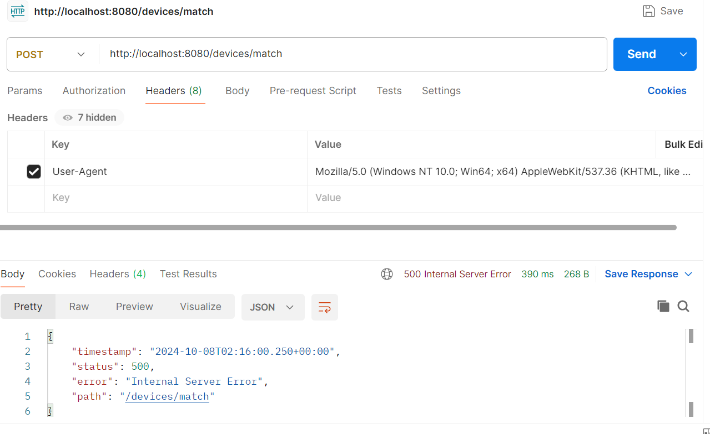

```
java.lang.IllegalArgumentException: Device.osName: expected CombinedQueryParam, instead got String
	at org.springframework.data.aerospike.repository.query.AerospikeQueryCreator.create(AerospikeQueryCreator.java:99) ~[spring-data-aerospike-4.8.0.jar:na]
	at org.springframework.data.aerospike.repository.query.AerospikeQueryCreator.create(AerospikeQueryCreator.java:51) ~[spring-data-aerospike-4.8.0.jar:na]
	at org.springframework.data.repository.query.parser.AbstractQueryCreator.createCriteria(AbstractQueryCreator.java:119) ~[spring-data-commons-3.3.0.jar:3.3.0]
	at org.springframework.data.repository.query.parser.AbstractQueryCreator.createQuery(AbstractQueryCreator.java:95) ~[spring-data-commons-3.3.0.jar:3.3.0]
	at org.springframework.data.repository.query.parser.AbstractQueryCreator.createQuery(AbstractQueryCreator.java:81) ~[spring-data-commons-3.3.0.jar:3.3.0]
	at org.springframework.data.aerospike.repository.query.BaseAerospikePartTreeQuery.createQuery(BaseAerospikePartTreeQuery.java:128) ~[spring-data-aerospike-4.8.0.jar:na]
	at org.springframework.data.aerospike.repository.query.BaseAerospikePartTreeQuery.prepareQuery(BaseAerospikePartTreeQuery.java:76) ~[spring-data-aerospike-4.8.0.jar:na]
	at org.springframework.data.aerospike.repository.query.AerospikePartTreeQuery.execute(AerospikePartTreeQuery.java:59) ~[spring-data-aerospike-4.8.0.jar:na]
	at org.springframework.data.repository.core.support.RepositoryMethodInvoker.doInvoke(RepositoryMethodInvoker.java:170) ~[spring-data-commons-3.3.0.jar:3.3.0]
	at org.springframework.data.repository.core.support.RepositoryMethodInvoker.invoke(RepositoryMethodInvoker.java:158) ~[spring-data-commons-3.3.0.jar:3.3.0]
	at org.springframework.data.repository.core.support.QueryExecutorMethodInterceptor.doInvoke(QueryExecutorMethodInterceptor.java:164) ~[spring-data-commons-3.3.0.jar:3.3.0]
	at org.springframework.data.repository.core.support.QueryExecutorMethodInterceptor.invoke(QueryExecutorMethodInterceptor.java:143) ~[spring-data-commons-3.3.0.jar:3.3.0]
	at org.springframework.aop.framework.ReflectiveMethodInvocation.proceed(ReflectiveMethodInvocation.java:184) ~[spring-aop-6.1.8.jar:6.1.8]
	at org.springframework.aop.interceptor.ExposeInvocationInterceptor.invoke(ExposeInvocationInterceptor.java:97) ~[spring-aop-6.1.8.jar:6.1.8]
	at org.springframework.aop.framework.ReflectiveMethodInvocation.proceed(ReflectiveMethodInvocation.java:184) ~[spring-aop-6.1.8.jar:6.1.8]
	at org.springframework.aop.framework.JdkDynamicAopProxy.invoke(JdkDynamicAopProxy.java:223) ~[spring-aop-6.1.8.jar:6.1.8]
	at jdk.proxy2/jdk.proxy2.$Proxy62.findByOsNameAndOsVersionAndBrowserNameAndBrowserVersion(Unknown Source) ~[na:na]
	at com.springboot.microservice.service.DeviceService.matchOrCreateDevice(DeviceService.java:28) ~[classes/:na]
	at com.springboot.microservice.rest.DeviceController.matchDevice(DeviceController.java:25) ~[classes/:na]
	at java.base/jdk.internal.reflect.DirectMethodHandleAccessor.invoke(DirectMethodHandleAccessor.java:103) ~[na:na]
	at java.base/java.lang.reflect.Method.invoke(Method.java:580) ~[na:na]

 ```
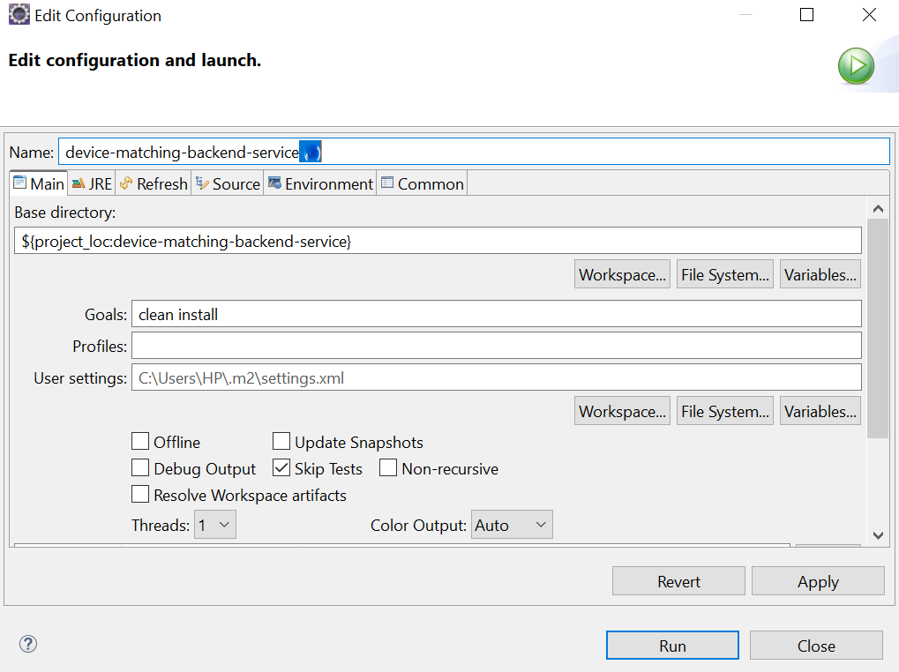

### After Fixing the dependencies compatibility issue

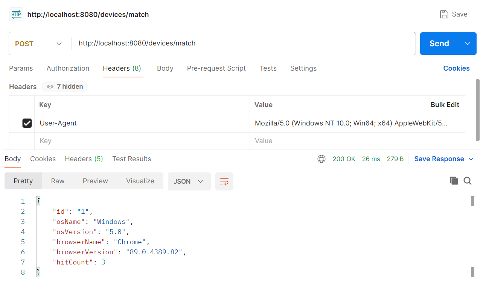

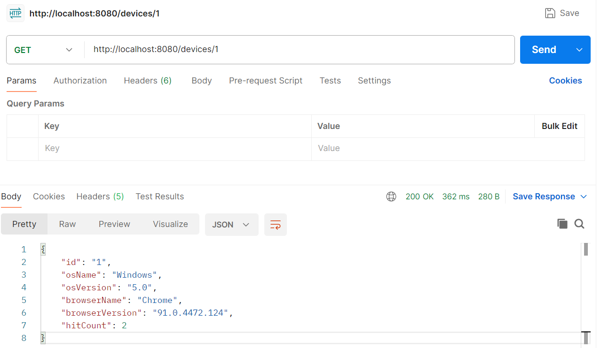

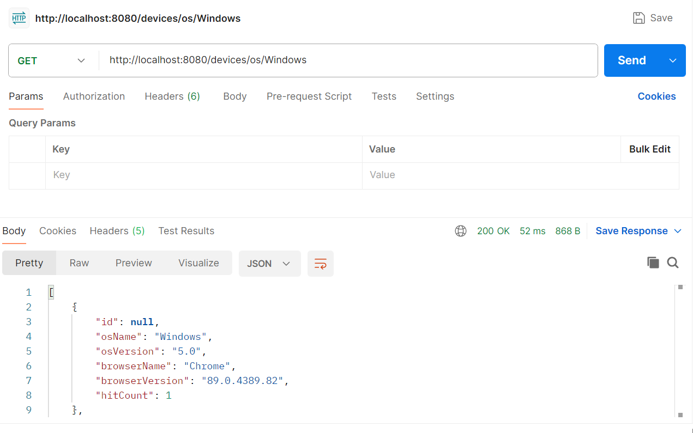

To create test cases for the `DeviceService` class, you can use JUnit and Mockito for unit testing. Below is an example of how to structure your test cases for each method in the `DeviceService` class.

### Test Class for `DeviceService`

```java
package com.springboot.microservice.service;

import static org.mockito.Mockito.*;
import static org.junit.jupiter.api.Assertions.*;

import java.util.Arrays;
import java.util.UUID;

import com.aerospike.client.AerospikeClient;
import com.aerospike.client.Bin;
import com.aerospike.client.Key;
import com.aerospike.client.Record;
import com.aerospike.client.policy.WritePolicy;
import com.aerospike.client.query.Filter;
import com.aerospike.client.query.RecordSet;
import com.aerospike.client.query.Statement;
import com.springboot.microservice.entity.Device;
import com.springboot.microservice.exception.DeviceServiceException;

import org.junit.jupiter.api.BeforeEach;
import org.junit.jupiter.api.Test;
import org.mockito.ArgumentCaptor;
import org.mockito.InjectMocks;
import org.mockito.Mock;
import org.mockito.MockitoAnnotations;

public class DeviceServiceTest {

    @InjectMocks
    private DeviceService deviceService;

    @Mock
    private AerospikeClient aerospikeClient;

    @Mock
    private RecordSet recordSet;

    @Mock
    private Record record;

    private final String namespace = "test";
    private final String setName = "devices";

    @BeforeEach
    public void setup() {
        MockitoAnnotations.openMocks(this);
    }

    @Test
    public void testMatchOrCreateDevice_NewDevice() {
        String userAgent = "Mozilla/5.0 (Windows NT 10.0; Win64; x64) AppleWebKit/537.36 (KHTML, like Gecko) Chrome/91.0.4472.124 Safari/537.36";
        UUID deviceId = UUID.randomUUID();
        Key key = new Key(namespace, setName, deviceId.toString());

        // Mock behavior
        when(aerospikeClient.get(null, key, new String[]{"os_name", "os_version", "berowser_name", "browser_version", "hit_count"})).thenReturn(null);
        when(aerospikeClient.put(any(WritePolicy.class), eq(key), any(Bin[].class))).thenReturn(null);

        // Call the method
        Device device = deviceService.matchOrCreateDevice(userAgent);

        // Validate results
        assertNotNull(device);
        assertEquals("Windows", device.getOsName());
        assertEquals("10.0", device.getOsVersion());
        assertEquals("Chrome", device.getBrowserName());
        assertEquals("91.0.4472.124", device.getBrowserVersion());
        assertEquals(1, device.getHitCount());

        // Verify interactions
        verify(aerospikeClient).put(any(WritePolicy.class), eq(key), any(Bin[].class));
    }

    @Test
    public void testMatchOrCreateDevice_ExistingDevice() {
        String userAgent = "Mozilla/5.0 (Windows NT 10.0; Win64; x64) AppleWebKit/537.36 (KHTML, like Gecko) Chrome/91.0.4472.124 Safari/537.36";
        UUID deviceId = UUID.randomUUID();
        Key key = new Key(namespace, setName, deviceId.toString());

        // Mock existing record
        when(aerospikeClient.get(null, key, new String[]{"os_name", "os_version", "berowser_name", "browser_version", "hit_count"})).thenReturn(record);
        when(record.getInt("hit_count")).thenReturn(1);
        when(record.getString("os_name")).thenReturn("Windows");
        when(record.getString("os_version")).thenReturn("10.0");
        when(record.getString("berowser_name")).thenReturn("Chrome");
        when(record.getString("browser_version")).thenReturn("91.0.4472.124");

        // Call the method
        Device device = deviceService.matchOrCreateDevice(userAgent);

        // Validate results
        assertNotNull(device);
        assertEquals(2, device.getHitCount());

        // Verify interactions
        verify(aerospikeClient).put(any(WritePolicy.class), eq(key), new Bin("hit_count", 2));
    }

    @Test
    public void testGetDeviceById_DeviceFound() {
        String deviceId = UUID.randomUUID().toString();
        Key key = new Key(namespace, setName, deviceId);

        // Mock record
        when(aerospikeClient.get(null, key, new String[]{"os_name", "os_version", "berowser_name", "browser_version", "hit_count"})).thenReturn(record);
        when(record.getString("os_name")).thenReturn("Windows");
        when(record.getString("os_version")).thenReturn("10.0");
        when(record.getString("berowser_name")).thenReturn("Chrome");
        when(record.getString("browser_version")).thenReturn("91.0.4472.124");
        when(record.getInt("hit_count")).thenReturn(1);

        // Call the method
        Device device = deviceService.getDeviceById(deviceId);

        // Validate results
        assertNotNull(device);
        assertEquals(deviceId, device.getId());
        assertEquals("Windows", device.getOsName());
    }

    @Test
    public void testGetDeviceById_DeviceNotFound() {
        String deviceId = UUID.randomUUID().toString();
        Key key = new Key(namespace, setName, deviceId);

        // Mock no record found
        when(aerospikeClient.get(null, key, new String[]{"os_name", "os_version", "berowser_name", "browser_version", "hit_count"})).thenReturn(null);

        // Call the method
        Device device = deviceService.getDeviceById(deviceId);

        // Validate results
        assertNotNull(device);
        assertEquals(deviceId, device.getId());
        assertEquals("Unknown OS", device.getOsName());
    }

    @Test
    public void testGetDevicesByOS() {
        String osName = "Windows";
        String deviceId = UUID.randomUUID().toString();

        // Mock behavior
        when(aerospikeClient.query(null, any(Statement.class))).thenReturn(recordSet);
        when(recordSet.next()).thenReturn(true).thenReturn(false); // Simulate one record found
        when(recordSet.getRecord()).thenReturn(record);
        when(record.getString("os_name")).thenReturn("Windows");
        when(record.getString("os_version")).thenReturn("10.0");
        when(record.getString("berowser_name")).thenReturn("Chrome");
        when(record.getString("browser_version")).thenReturn("91.0.4472.124");
        when(record.getInt("hit_count")).thenReturn(1);
        when(record.getString("id")).thenReturn(deviceId);

        // Call the method
        List<Device> devices = deviceService.getDevicesByOS(osName);

        // Validate results
        assertEquals(1, devices.size());
        assertEquals(deviceId, devices.get(0).getId());
    }

    @Test
    public void testDeleteDevice_DeviceExists() {
        String deviceId = UUID.randomUUID().toString();
        Key key = new Key(namespace, setName, deviceId);

        // Mock behavior
        when(aerospikeClient.delete(any(WritePolicy.class), eq(key))).thenReturn(true);

        // Call the method
        deviceService.deleteDevice(deviceId);

        // Verify interactions
        verify(aerospikeClient).delete(any(WritePolicy.class), eq(key));
    }

    @Test
    public void testDeleteDevice_DeviceNotFound() {
        String deviceId = UUID.randomUUID().toString();
        Key key = new Key(namespace, setName, deviceId);

        // Mock behavior
        when(aerospikeClient.delete(any(WritePolicy.class), eq(key))).thenReturn(false);

        // Call the method
        deviceService.deleteDevice(deviceId);

        // Verify interactions
        verify(aerospikeClient).delete(any(WritePolicy.class), eq(key));
    }
}
```

### Explanation

1. **Mockito Annotations**: We use `@InjectMocks` to create an instance of `DeviceService` with mocked dependencies. `@Mock` is used for the `AerospikeClient`, `RecordSet`, and `Record` classes.

2. **Setup Method**: In the `setup` method, we initialize the mocks.

3. **Test Cases**:
   - **testMatchOrCreateDevice_NewDevice**: Tests creating a new device from a user agent string.
   - **testMatchOrCreateDevice_ExistingDevice**: Tests updating an existing device.
   - **testGetDeviceById_DeviceFound**: Tests retrieving a device that exists.
   - **testGetDeviceById_DeviceNotFound**: Tests retrieving a device that does not exist.
   - **testGetDevicesByOS**: Tests getting devices by OS name.
   - **testDeleteDevice_DeviceExists**: Tests deleting a device that exists.
   - **testDeleteDevice_DeviceNotFound**: Tests the deletion of a device that does not exist.

### Notes
- Ensure you have the necessary dependencies for JUnit and Mockito in your `pom.xml` or build.gradle file.
- Customize the `userAgent` string in the tests based on your requirements or further details on how the parsing works.
- Handle any exceptions as appropriate for your testing context.
